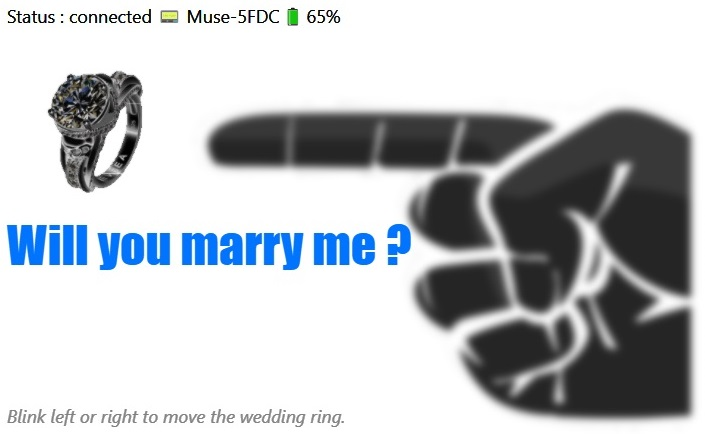
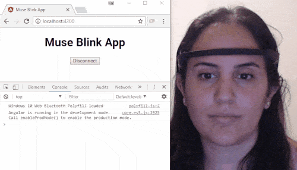

# Muse EEG controller

> a test project to play with Muse EEG headset

---

## Why

I saw this [post on Medium](https://urish.medium.com/reactive-brain-waves-af07864bb7d4) written by Uri Shaked (Google Developer Expert for Web Technologies, Maker and Public Speaker)

So I bought a **2016 Muse headset** and made my own experiment ;)

## Usage

- online : go to [muse-ml5.netlify.app](https://muse-ml5.netlify.app)
- or locally : clone this repo, `npm install` & `npm start`

Then use your **2016 Muse headset** & your eyes to play.

## TODO

- [ ] found something to do with ml5 😅 as you can see in the project name, I planned to use ML5 here

## Thanks

- [Eslint](https://eslint.org) : super tool to find & fix problems
- [Github](https://github.com) : for all their great work year after year, pushing OSS forward
- [Muse.js](https://github.com/urish/muse-js) : offering a simple to use api to Muse 2016 EEG Headset via Web Bluetooth
- [Netlify](https://netlify.com) : awesome company that offers free CI & hosting for OSS projects
- [Npm-run-all](https://github.com/mysticatea/npm-run-all) : great tool to organize npm scripts, it let you run multiple npm-scripts in parallel or sequential
- [Parcel](https://github.com/parcel-bundler/parcel) : web app bundler
- [PngTree](https://pngtree.com/freepng/raise-the-index-finger-gesture-illustration_4558386.html) : for the finger & ring illustrations
- [Reef](https://reefjs.com) : lightweight library for creating reactive, state-based components and UI
- [Repo-checker](https://github.com/Shuunen/repo-checker) : personal tool to keep every repo clean
- [Sakura.css](https://oxal.org/projects/sakura) : a minimal classless css framework / theme for HTML semantic lovers
- [Serve](https://github.com/vercel/serve) : easy to use static file server
- [Shields.io](https://shields.io) : for the nice badges on top of this readme
- [Strabo](https://www.iconfinder.com/icons/71526/contrast_icon) : for the contrast icons
- [Travis-ci.org](https://travis-ci.org) : for providing free continuous deployments
